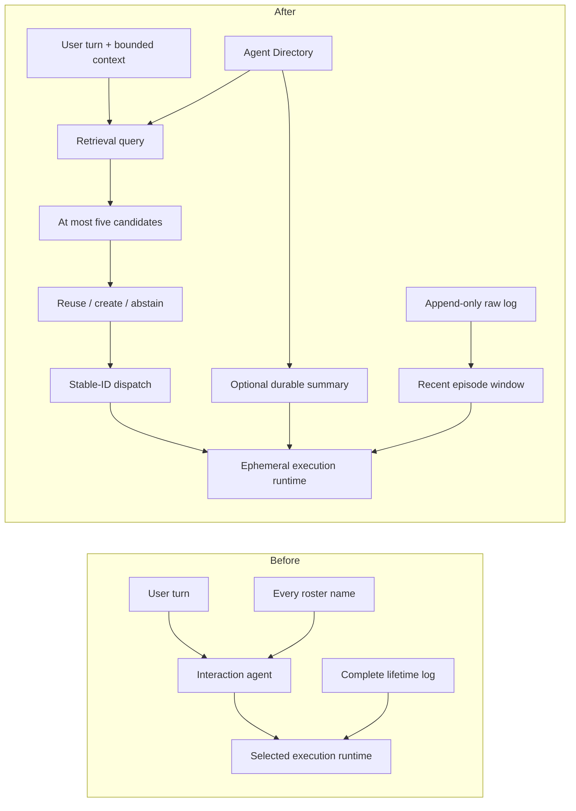

# Architecture: bounded attention with durable identity

## Problem framing

OpenPoke's interaction/execution split is useful: one conversational assistant
can delegate work while specialized execution agents retain relationship and
task continuity. The overload is not simply “too many processes.” It is two
unbounded context surfaces:

1. **Breadth:** every persistent identity is rendered into every interaction
   turn, so prompt size and the supervisor's choice set grow with lifetime use.
2. **Depth:** after an identity is selected, its complete execution log is
   rendered into the worker prompt, so one long relationship also grows without
   bound.

The solution bounds both attention surfaces in code while preserving durable
records and raw logs.

## Before and after

## Component boundaries

### Agent Directory

`server/services/execution/directory.py` is the source of truth for identity.
Each immutable record has a UUID, display name, routing purpose, aliases,
lifecycle status, creation/use timestamps, use count, optional memory summary,
and schema version.

- Legacy name-list rosters migrate deterministically and idempotently.
- Writes use a lock file plus atomic replacement; malformed data fails without
  overwriting the source.
- Duplicate names and aliases remain distinct records. Retrieval resolves
  ambiguity rather than silently merging identities.
- `hot`, `dormant`, and `archived` transitions are explicit. Archived records
  remain recoverable; nothing is destructively deleted.
- The old `get_agent_roster().get_agents()` API remains as a compatibility
  adapter during migration.

### Retrieval

`server/services/execution/retrieval.py` performs a deterministic local hybrid
score over name, purpose, aliases, memory summary, recency, use count, and
lifecycle status. It returns auditable score components and reasons, but only a
strictly bounded top K (default five).

Exact normalized names and aliases dominate weak recency. Dormant and archived
records receive small penalties rather than disappearing. Sorting has a stable
tie-break, so identical inputs produce identical rankings.

### Routing

`server/services/execution/routing.py` is intentionally separate from
retrieval:

- **reuse** when one candidate clears the relevance threshold and ambiguity
  margin;
- **create_new** when nothing is sufficiently relevant; and
- **abstain** when multiple candidates remain materially ambiguous.

This separation makes top-K recall measurable independently from final routing
accuracy and leaves a clean interface for a future semantic or probabilistic
router.

### Interaction-agent integration

`server/agents/interaction_agent/agent.py` builds a query from the latest turn
and existing bounded working-memory transcript. The LLM sees `<agent_candidates>`,
not the lifetime roster. Candidate entries contain stable ID, name, purpose,
status, and concise relevance hints; numeric scores are not presented as
user-facing certainty.

`send_message_to_agent` reuses only a known stable ID. An unknown/stale ID fails
closed before logging or dispatch. Creating a new identity requires both name
and purpose, and repeated creation calls within one interaction turn resolve to
the same ID.

Stable IDs are also execution-log and tool-registry keys, preventing display
names such as `A B` and `A-B` from colliding. Name-owned legacy scheduled work
continues through the optional-ID runtime compatibility path.

### Context policy

`server/services/execution/context_policy.py` renders, in order:

1. a valid durable memory summary, when present;
2. a contiguous suffix of recent complete execution episodes; and
3. an explicit marker that older raw entries were omitted.

Both recent episode count (default eight) and rendered character count (default
12,000) are hard limits. A single oversized entry receives an explicit bounded
representation. Rendering exposes raw and rendered sizes, included episodes,
omitted entries, truncation, and summary use.

The policy only reads `ExecutionAgentLogStore`; raw bytes are unchanged. Missing
or malformed summaries fall back to recent raw episodes.

## Failure handling

- Corrupt directory JSON raises a typed error and remains untouched.
- Unknown stable IDs never fall back to a same-looking name.
- Ambiguous candidates ask for clarification rather than selecting silently.
- No candidate above threshold creates a new identity explicitly.
- Optional summaries may be ignored, but recent raw episodes remain available.
- Oversized entries are marked as truncated; omission is never invisible.
- Provider credentials are outside all deterministic tests and evaluations.

## Why persistent identities remain

Making every runtime task ephemeral would bound worker lifetime but would move
the unresolved problem into state reconstruction: which email thread, person,
approval state, or scheduled trigger belongs to this request? OpenPoke's durable
identities are useful. The chosen vertical slice makes them searchable and
hibernatable while keeping runtime processes ephemeral.

## Longer-term alternative

A more fundamental design would separate:

- durable entities (people, organizations, threads),
- durable tasks and approvals, and
- a small fixed pool of capability workers.

That task/entity ledger prevents many unnecessary “agents” from existing at
all. It is a promising next architecture, but replacing OpenPoke's identity
model would obscure the take-home's measured comparison and exceed the bounded
scope.

## Why Jev is optional

A probabilistic classifier such as Jev can choose among a bounded candidate set
or abstain, but passing every identity to it simply moves overload downstream.
It is therefore an optional routing adapter after deterministic retrieval, not
a required dependency. The default path remains reproducible for reviewers who
have no provider access.

