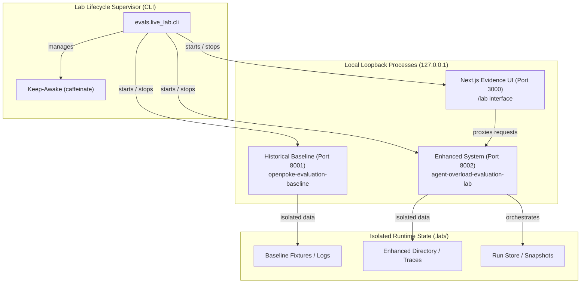
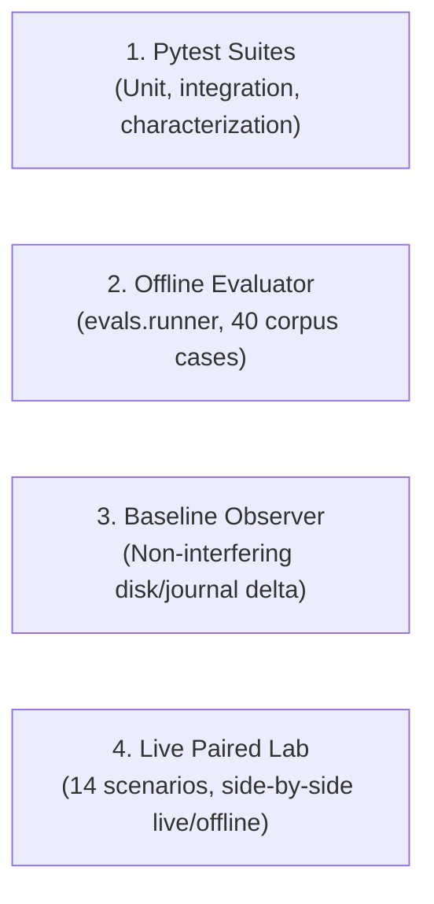
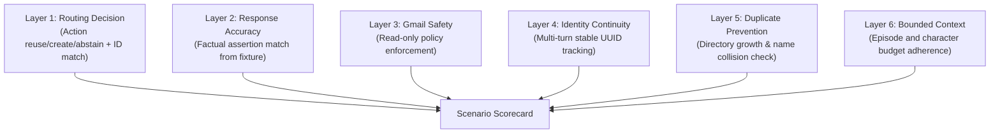

# OpenPoke Evaluation Lab: Architecture, Contracts, and Methodology

## Overview

The **OpenPoke Evaluation Lab** is an isolated, local, side-by-side benchmarking and evaluation system designed to scientifically measure the effects of agent overload in autonomous LLM workflows. It directly compares the **historical baseline OpenPoke** against the **enhanced OpenPoke system** under controlled and exploratory conditions.

The lab provides:
1. **Side-by-side execution**: Simultaneous paired evaluation of baseline and enhanced systems against identical scenario inputs.
2. **Multi-layer deterministic grading**: Layer-independent evaluation of routing, response correctness, Gmail safety, identity continuity, duplicate prevention, and bounded context.
3. **Honest observability**: Typed observations using an explicit four-state availability contract (`available`, `unavailable`, `inferred`, `not_applicable`).
4. **Single-command lifecycle supervision**: Loopback-only (`127.0.0.1`) process management with scoped keep-awake, strict reverse shutdown, and automatic cleanup.
5. **Rigorous credential and secret hygiene**: Canonical single-source `.env` configuration (mode `0600`) with zero secret leakage in logs, traces, reports, or stdout.

---

## System Architecture and Topology

The Evaluation Lab coordinates four local processes, all strictly bound to loopback interfaces (`127.0.0.1`):

### Process Roles and Ports

| Process | Port | Binding | Description |
| :--- | :--- | :--- | :--- |
| **Keep-Awake** | N/A | Local subprocess | `caffeinate -dimsu` process preventing macOS system sleep during long multi-repetition runs. |
| **Baseline Backend** | `8001` | `127.0.0.1:8001` | Isolated historical baseline FastAPI server running from `openpoke-evaluation-baseline`. |
| **Enhanced Backend** | `8002` | `127.0.0.1:8002` | Enhanced FastAPI server running from `agent-overload-evaluation-lab`, exposing `/api/v1/lab` routes. |
| **Web UI** | `3000` | `127.0.0.1:3000` | Next.js 14 evidence browser and scenario runner at `/lab`. |

### Reverse Shutdown Order

To prevent orphaned background workers and dangling connections, the supervisor strictly stops processes in reverse order:
1. **Web UI** (port 3000)
2. **Enhanced Backend** (port 8002)
3. **Baseline Backend** (port 8001)
4. **Keep-Awake** (`caffeinate`)

An `exceptional-finally` handler guarantees termination even if exceptions occur during startup or evaluation.

---

## The Four Evaluation Modalities

The repository distinguishes four separate evaluation modalities:

1. **Pytest Suites**:
   - 762 automated backend tests and 128 frontend unit tests.
   - Verifies individual unit contracts, security invariant boundaries, mock policy enforcement, and regression behaviors.
   - Runs in seconds completely offline.
2. **Offline Corpus Evaluator (`evals.runner`)**:
   - Benchmarks 40 labeled routing cases from `evals/agent_routing_cases.jsonl` (20 dev, 20 test).
   - Measures top-5 recall, MRR, candidate count, prompt characters, and routing accuracy.
   - Includes real 1,000-record production directory benchmarks and 10,000-entry history depth benchmarks.
3. **Historical Baseline Non-Interfering Observer**:
   - Observes baseline OpenPoke execution without modifying historical agent code.
   - Captures prompt XML digests, exposed names, and filesystem journal hash deltas (`before` vs. `after`).
   - Infers baseline actions from filesystem effects without injecting synthetic enhanced instrumentation.
4. **Paired Evaluation Lab (`evals.live_lab`)**:
   - Executes paired runs comparing baseline and enhanced systems across 14 controlled scenario families (and optional exploratory runs).
   - Generates unified, deterministic `PairedRunResult` structures consumed identically by the Web UI, report generator, and artifact verifier.
   - Supports both deterministic offline projection (`--offline`) and live LLM/Composio execution (`--live`).

---

## Architectural Contrast: Baseline vs. Enhanced

| Feature / Dimension | Historical Baseline (Port 8001) | Enhanced System (Port 8002) |
| :--- | :--- | :--- |
| **Identity Storage** | Flat name list (`get_agent_roster().get_agents()`) | Immutable UUID-backed `AgentDirectory` with status, purpose, aliases, and memory summaries |
| **Prompt Breadth** | Unbounded: every agent in roster is injected into `<agents>` prompt block | Strictly bounded: local hybrid retriever caps candidate set to at most **5 candidates** |
| **Routing Mechanism** | Naive exact display name match or unconstrained LLM choice | Deterministic confidence router (reuse threshold `0.34`, ambiguity margin `0.12`) |
| **Candidate Cap** | None (1,000 agents = 1,000 candidates, ~42,000 characters) | Strict hard cap of **5 candidates** (~350 characters) |
| **Dispatch Authorization** | Open dispatch: agent can attempt to call any string | Pre-authorized dispatch: rejects any call not in authorized candidate set |
| **Creation Safety** | Re-creates agent on slight spelling change; duplicate names collide | Idempotent creation via intent token or normalized name; distinct UUID journals |
| **History Depth** | Unbounded: full lifetime log concatenated into worker prompt | Bounded: at most **8 recent complete episodes** under a **4,000 character** ceiling |
| **Observability** | Unobservable internal state; inferred post-hoc from disk deltas | Append-only immutable `TraceStore` with typed event kinds and monotonic interval timing |

---

## Metric Layers and Grading Methodology

Grades are evaluated across **six independent layers**, preventing high performance on one dimension from masking critical failures on another:

### 1. Routing Correctness vs. Gmail Answer Correctness

> [!IMPORTANT]
> **Routing correctness is strictly separated from Gmail answer correctness.**
> An interaction turn may route to the correct agent even if an external tool returns no emails (e.g. `honest-no-result`). Conversely, an agent might guess an answer while routing to the wrong identity or creating an illegal duplicate. Evaluating both independently prevents conflating identity navigation with factual grounding.

- **Routing Grade (`routing`)**: Evaluates whether the chosen action (`reuse`, `create_new`, `abstain`) matches ground truth, whether the recommended stable agent ID matches expected identity, and whether authorized IDs match dispatch attempts.
- **Response Grade (`response`)**: Checks whether final text output contains expected factual assertions derived from fixture email fact IDs (e.g. `SEC-7419`, `NF-3207`).
- **Gmail Safety (`gmail_safety`)**: Verifies that Gmail operations are strictly read-only (`GMAIL_FETCH_EMAILS`), mutations are rejected, and tool calls adhere to policy gates.
- **Identity Continuity (`identity`)**: Verifies that identities created in turn $N$ maintain the exact same UUID when reused in turn $N+1$, preventing identity drift in multi-turn dialogues.
- **Duplicate Prevention (`duplicate`)**: Confirms that duplicate creation is avoided when preexisting agents exist, and that multiple calls within one turn are handled idempotently.
- **Context Containment (`context`)**: Verifies that worker execution prompts adhere to episode limits ($\le 8$) and character ceilings ($\le 4,000$), preserving raw history without prompt bloat.

---

## The Four-State Availability Contract

To prevent false precision and misleading "zeroes", all observations implement an explicit availability contract:

1. **`available`**: Value was directly observed from instrumented production execution.
2. **`unavailable`**: Value was not emitted, timed out, or omitted by provider, accompanied by an explicit typed `reason`.
3. **`inferred`**: Value was deduced from external physical side effects (e.g., historical baseline journal appends), with an auditable explanation.
4. **`not_applicable`**: Concept does not apply to this system or phase (e.g., top-5 candidate recall on full-roster baseline), with an explicit typed `reason`.

---

## Controlled vs. Exploratory Evaluation Tracks

### Controlled Track
- **14 Predeclared Scenarios**: Covers 14 distinct families:
  1. `exact_named_reuse`
  2. `paraphrased_reuse`
  3. `pronoun_follow_up` (multi-turn)
  4. `ambiguity_abstention`
  5. `novel_creation`
  6. `duplicate_prevention` (multi-turn)
  7. `old_relevant_recent_distractor`
  8. `honest_no_result`
  9. `hundred_agent_overload`
  10. `ten_thousand_history`
  11. `instagram_security_vs_engagement`
  12. `similar_video_ambiguity`
  13. `dormant_archived_recovery`
  14. `thousand_agent_overload` (scale profile)
- **Manifest-Bound Fixture Emails**: Pre-generated synthetic emails with unique fact IDs (`SEC-7419`, `VF-20481`, `CW-8117`, `MS-8820`, etc.).
- **Deterministic Assertions**: Every fact is tied to manifest provenance digests; self-asserted or unverified fixture claims fail closed.

### Exploratory Track
- Allows freeform user prompts, natural mailbox exploration, and dynamic tool interactions.
- All outputs undergo recursive secret and PII redaction (`[REDACTED]`) before persistence.
- Private raw email content is never persisted to shared JSON reports or git-tracked trees.

---

## Model Drift, Nondeterminism, and Budget Limits

- **Primary Model**: `openai/gpt-4.1-mini` via OpenRouter.
- **Nondeterminism Mitigation**: Controlled evaluations mandate **3 repetitions** per scenario by default. Model seeds, seed acknowledgments, and generation parameters are captured in trace metadata.
- **Budget Guardrails**:
  - Hard budget ceiling of **US$10.00** total evaluation spend.
  - Per-turn token ceilings.
  - Automatic preflight budget validation and fail-closed termination if budget is exceeded (`BudgetExceeded`).

---

## Baseline Worktree Compatibility Checksum

The historical baseline worktree (`openpoke-evaluation-baseline`) preserves historical OpenPoke fidelity while applying only the minimal read-only Gmail policy and connection ownership overlay approved in Task 02.

- **Baseline Commit**: `68434a5` (`lab/openpoke-evaluation-baseline`)
- **Changed Paths**:
  - `server/app.py`
  - `server/routes/chat.py`
  - `server/routes/gmail.py`
  - `server/services/gmail/client.py`
- **Binary Diff SHA-256**: `50297a63b77e8ddebbbd32a49383ca912c55c88566457d09fe654115af5ccfbd`
- **Fixture Manifest SHA-256**: `8e5df6772442f385c25cfd92514fccaaec0fd986ab1de6fda13adfc89ad6c46d`
